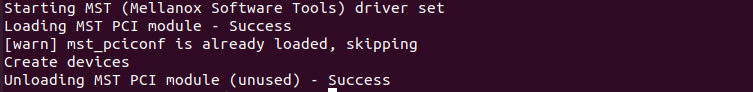
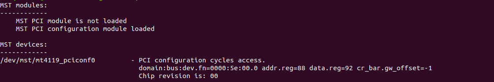
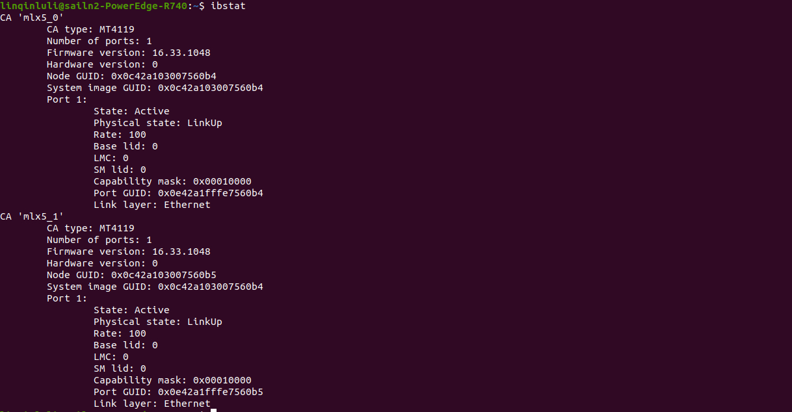
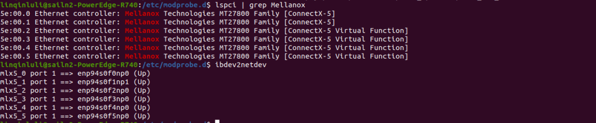

# Configure RDMA in KVM VM（Ethernet connected）

## 1. Set SR-IOV

### a. Configure in host machine

1）make sure you have NIC which supported RDMA connection install on PCIE port

2）install kvm

```shell
sudo apt-get install qemu-kvm
sudo apt-get install virt-manager libvirt libvirt-python python-virtinst
```

3）set up SR-IOV on BIO

Here is the tutorial we used in our server

[HowTo Set Dell PowerEdge R730 BIOS parameters to support SR-IOV (nvidia.com)](https://enterprise-support.nvidia.com/s/article/howto-set-dell-poweredge-r730-bios-parameters-to-support-sr-iov)

4）set **intel_iommu=on**和**iommu=pt** in grub settings

5）install MLNX_OFED driver

6）start MFT

```shell
sudo mst start
```



7）find the PCIe port yout NIC device using

```shell
sudo mst status
```



Here is `/dev/mst/mt4119_pciconf0`

8）set NIC to trun on SR-IOV and set the number of VFs.

```shell
sudo mlxconfig -d /dev/mst/mt4119_pciconf0 q # query
sudo mlxconfig -d /dev/mst/mt4119_pciconf0 set SRIOV_EN=1 NUM_OF_VFS=4 # set parameters
```

- SRIOV_EN=1
- NUM_OF_VFS=4

After these steps, reboot your system

### b. Set SR-IOV in MLNX_OFED driver

1）find the NIC port number of your device

```shell
ibstat 
```



Here are two ports mlx5_0 and mlx_1, make sure the device you use have

State: Active

Physical state: LinkUp

```shell
ibdev2netdev # query binding status of port and NIC devices
```


mlx5_0 port 1 ==> enp94s0f0np0 (Up)
mlx5_1 port 1 ==> enp94s0f1np1 (Up)

2）get the number of VFs hardware supported

```shell
 cat /sys/class/net/enp94s0f0np0/device/sriov_totalvfs
```

result is 4, which means the parameter **NUM_OF_VFS=4** we set.

If the result is empty，it means **intel_iommu=on** failed

3）set number of VFs in software

here are 3 methods

```shell
sudo sh -c "echo 4 > /sys/class/infiniband/mlx5_0/device/mlx5_num_vfs"
sudo cat /sys/class/infiniband/mlx5_0/device/mlx5_num_vfs

sudo sh -c "echo 4 > /sys/class/net/enp94s0f0np0/device/sriov_numvfs"
sudo cat /sys/class/net/enp94s0f0np0/device/sriov_numvfs

sudo sh -c "echo 4 > /sys/class/net/enp94s0f0np0/device/mlx5_num_vfs"
sudo cat /sys/class/net/enp94s0f0np0/device/mlx5_num_vfs
```

Any method is fine, you only need to execute one command.

if `sriov_numvfs` is not exiting, you should check **intel_iommu** whether have been added to grub file.

4）Then set automatic detection of VFs

```shell
sudo sh -c "echo 0 > /sys/class/infiniband/mlx5_0/device/mlx5_num_vfs"
# turn off sr-iov
sudo sh -c "echo 1 > /sys/module/mlx5_core/parameters/probe_vf"
# set automatic detection of VFs
sudo sh -c "echo 4 > /sys/class/infiniband/mlx5_0/device/mlx5_num_vfs"
# turn on sr-iov
```

**attention！！！**

you should execute step 3) and 4) after you reboot your system.

4）check

```shell
lspci -D | grep Mellanox # PCI状态
```



这里几个VF的基本信息如下：

| PCI Function | VF num |              | MAC               |
| ------------ |:------:| ------------ | ----------------- |
| 0000:5e:00.2 | 0      | enp94s0f2np0 | 00:22:33:44:55:66 |
| 0000:5e:00.3 | 1      | enp94s0f3np0 | 00:22:33:44:55:77 |
| 0000:5e:00.4 | 2      | enp94s0f4np0 | 00:22:33:44:55:88 |
| 0000:5e:00.5 | 3      | enp94s0f5np0 | 00:22:33:44:55:99 |

5）为每个VF设置MAC地址

运行

```shell
ip link show
```

看到几个vf都没有分配MAC地址

运行以下命令分配MAC地址

```shell
sudo sh -c "echo 0000:5e:00.2 > /sys/bus/pci/drivers/mlx5_core/unbind"

sudo ip link set enp94s0f0np0 vf 0 mac 00:22:33:44:55:66

sudo sh -c "echo 0000:5e:00.2 > /sys/bus/pci/drivers/mlx5_core/bind"
```

之后运行 `ip link show`，结果如下，可以看到MAC地址已经配置完成，之后使用此VF0进行实验

### 3.虚拟机配置

1）为虚拟机添加PCI设备

在添加之前关闭虚拟机

2）为虚拟机安装MLNX_OFED，可参考

[Mellanox网卡OFED驱动安装 - 简书 (jianshu.com)](https://www.jianshu.com/p/351635db6cc2)

常用指令

```shell
sudo su #进入root权限用户
sudo mount -o loop /root/MLNX_OFED_LINUX-5.4-3.5.8.0-ubuntu16.04-x86_64.iso /mnt/iso/
#挂载镜像
sudo ./mlnxofedinstall #运行安装程序
/etc/init.d/openibd restart #重启驱动
/usr/sbin/ofed_uninstall.sh #卸载驱动
```

3）为虚拟机配置IP地址

```shell
ifconfig [网卡名] [ip] up
```

4）测试RDMA通信情况，至此可以看到kvm虚拟机中RDMA通信成功，可以进行后续实验

Normalized
