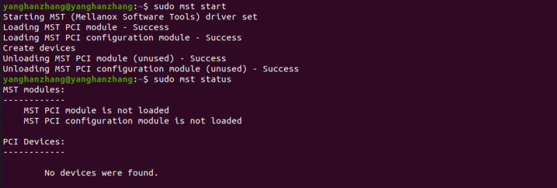
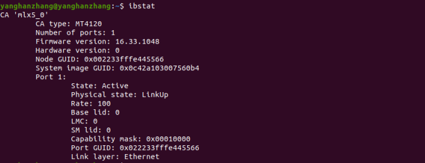
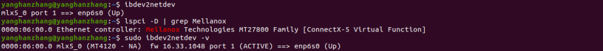
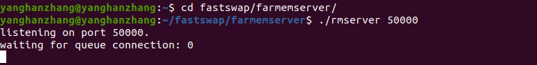
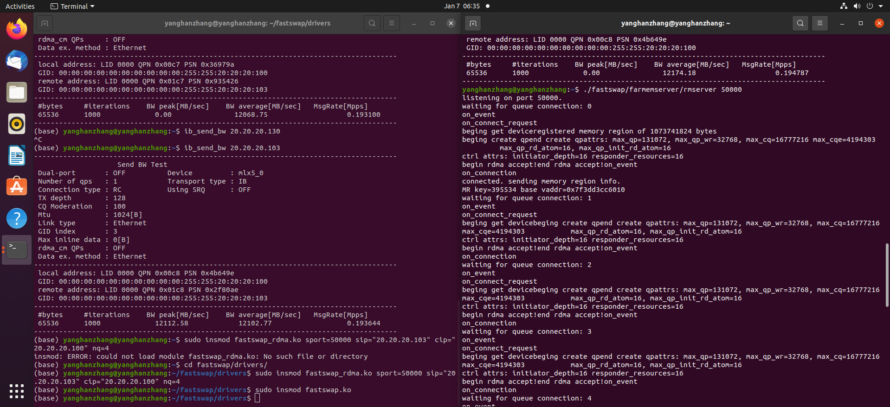
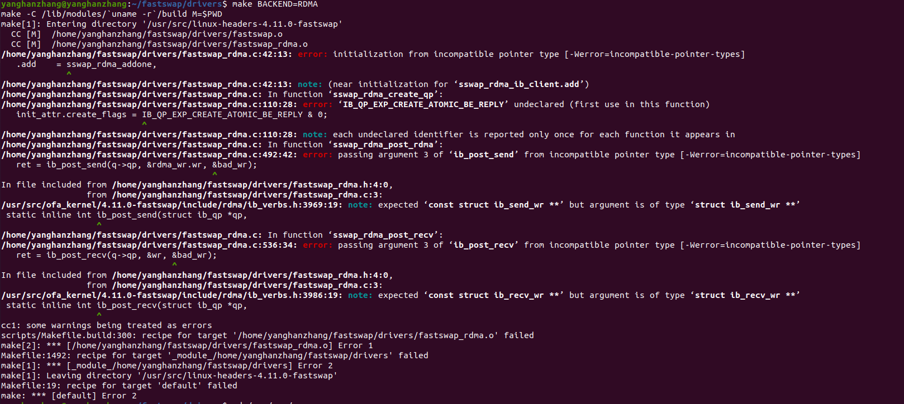
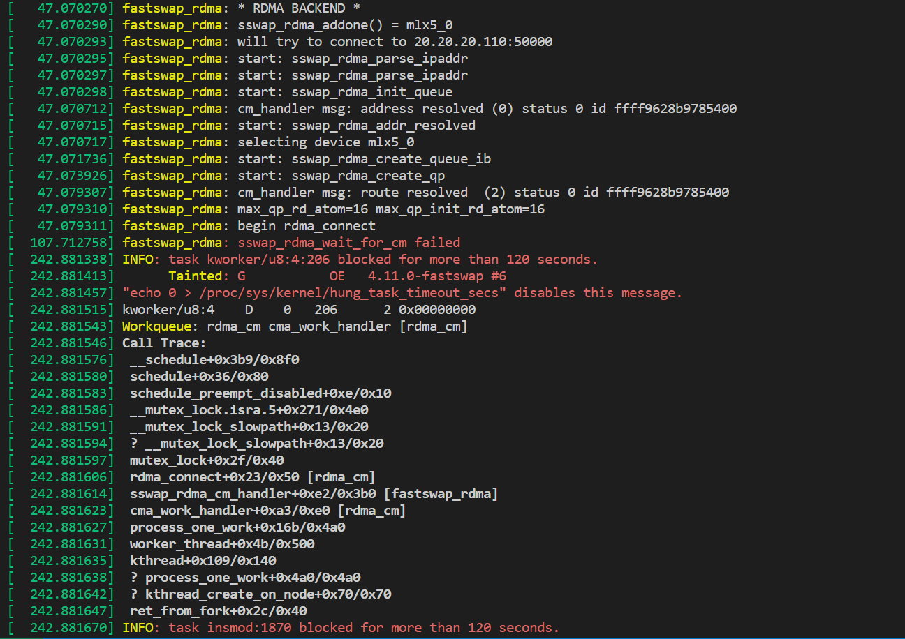
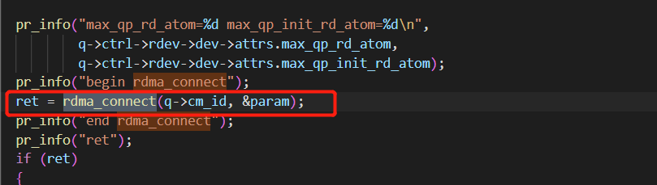

# kvm虚拟机中fastswap配置

## 一、基本配置

利用SR-IOV技术实现了虚拟机环境下的RDMA配置，能够进行RDMA有关benchmark的运行

1. 进入虚拟机
   
   ```shell
   # 1. ssh登录我的n2服务器账号
   # -y是为了使用virt-manager GUI，不需要可删掉
   ssh -Y -p 9151 linqinluli@202.120.39.14 
   password: yhz20010101
   # 2. 登录虚拟机,虚拟机root密码同登录密码
   ssh yanghanzhang@192.168.122.100
   password: yanghanzhang
   # 3. 登录gpu1，用作rdma server，目前gpu1上版本不对
   ssh -Y -p 9035 yanghanzhang@202.120.39.14
   password: yanghanzhang
   # 我开了另一台虚拟机用作server实验，
   ssh yanghanzhang@192.168.122.103
   password: yanghanzhang
   ```

2. 配置虚拟网卡ip
   
   ```shell
   sudo ifconfig enp6s0 20.20.20.100 up
   ```

3. 查看RDMA配置情况
   
   ```shell
   sudo mst start
   sudo mst status
   ```

这里存在找不到设备的情况！！！（并没有什么影响）~~可能是问题所在，网上有人遇到类似问题~~

[MST does not load · Issue #21 · Azure/azhpc-images (github.com)](https://github.com/Azure/azhpc-images/issues/21)



```shell

```



```shell
lspci -D | grep Mellanox # PCI状态
sudo ibdev2netdev -v    # 驱动绑定状态
```



4. RDMA测试，参考该网站，有较完整的RDMA测试benchmark
   
   [How To Enable, Verify and Troubleshoot RDMA (mellanox.com)](https://support.mellanox.com/s/article/How-To-Enable-Verify-and-Troubleshoot-RDMA)
   
   

## 二、Fastswap安装

参考fastswap GitHub上的安装流程

[clusterfarmem/fastswap: Fastswap, a fast swap system for far memory through RDMA (github.com)](https://github.com/clusterfarmem/fastswap)

其中最最最最最最最最重要的是，使用和github上一样的**4.3版本的OFED Driver**，后面遇到的所有问题都可以解决了

目前在两台虚拟机上安装的fastswap，需要和之前一样完成虚拟机中RDMA的配置

记住每次虚拟机关机or重启需要重新配置ip

```shell
sudo ifconfig enp6s0 20.20.20.100 up # client的配置

sudo ifconfig enp6s0 20.20.20.130 up # server的配置
```

之后简单测试能够互相ib_send_bw即可

server:

```shell
cd fastswap/farmemserver
make
./rmserver 50000
```



client:

```shell
# 编译
cd drivers
make BACKEND=RDMA
# 安装
sudo insmod fastswap_rdma.ko sport=50000 sip="20.20.20.110" cip="20.20.20.100" nq=4
sudo insmod fastswap.ko
```

## 二、Fastswap安装

参考fastswap GitHub上的安装流程

[clusterfarmem/fastswap: Fastswap, a fast swap system for far memory through RDMA (github.com)](https://github.com/clusterfarmem/fastswap)

rdma server端运行：

```shell
./fastswap/farmemserver/rmserver 50000
```

rdma client端（即虚拟机内）运行

```shell
sudo insmod fastswap_rdma.ko sport=50000 sip="20.20.20.110" cip="20.20.20.100" nq=4
```



到此fastswap已经安装完成，即初步的并行远内存系统后端搭建完成，下一步在该系统运行不同程序，分析程序特征

## 问题排查

### 一、fastswap安装版本问题

#### 问题描述

其中为了编译通过对fastswap_rdma.c文件进行了修改，修改之前报错如下：



针对报错修改如下：

a. IB_QP_EXP_CREATE_ATOMIC_BE_REPLY用来看编译所有头文件对不对，但现在这个版本似乎没有这个变量，直接删掉

b. static void sswap_rdma_addone(struct ib_device *dev)函数改为

static int sswap_rdma_addone(struct ib_device *dev)

c. struct ib_send_wr *bad_wr和struct ib_recv_wr *bad_wr分别添加const限定

之后编译通过，继续按照安装步骤进行安装

到了安装fastswap_rdma.ko文件的时候遇到了运行错误

```shell
sudo insmod fastswap_rdma.ko sport=40000 sip="20.20.20.21" cip="20.20.20.100" nq=4
```

dmesg看到的输出如下，其中用输出debug法定位到问题在ret = rdma_connect(q->cm_id, &param)这个函数，运行到这儿直接阻塞住，进而触发后续的wait失败



rdma_wait_for_cm_failed：

直接原因：

ret = sswap_rdma_wait_for_cm(queue)失败

该函数调用

```cpp
wait_for_completion_interruptible_timeout(&queue->cm_done,
msecs_to_jiffies(CONNECTION_TIMEOUT_MS) + 1)
//CONNECTION_TIMEOUT_MS 设置的60s应该不会是这个设置太短的原因
```

而queue->cm_done信号量一直没有被释放，运行超时，看cm_handler函数里面对cm_done进行释放的事件即RDMA_CM_EVENT_ESTABLISHED，因此可以看出没有成功创建连接。

通过pr_info定位到程序阻塞在了rdma_connect()该函数中



#### 问题解决：

a. 我尝试过调整参数，或者直接设为NULL还是会导致程序一直挂在这儿

b. 尝试从后两句报错入手修改，也不是问题所在，还是会卡在rdma_connect这一步

c. 发现使用的ofed内核版本不对，不是4.11的版本，有点怀疑之前装内核这一步错了orz

**d. rdma通信两端都改成4.3版本的OFED Driver，问题解决！**
